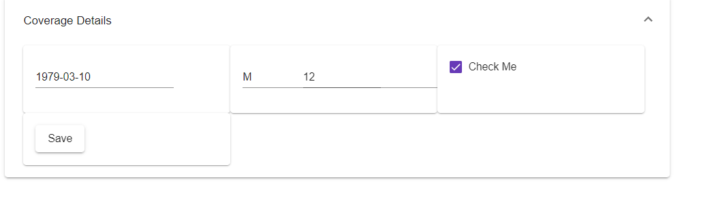
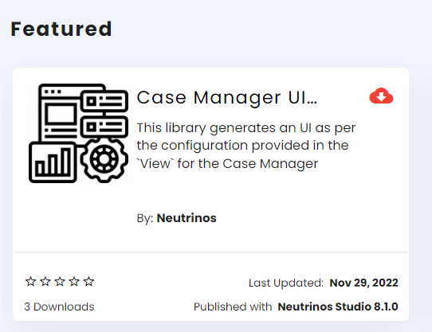
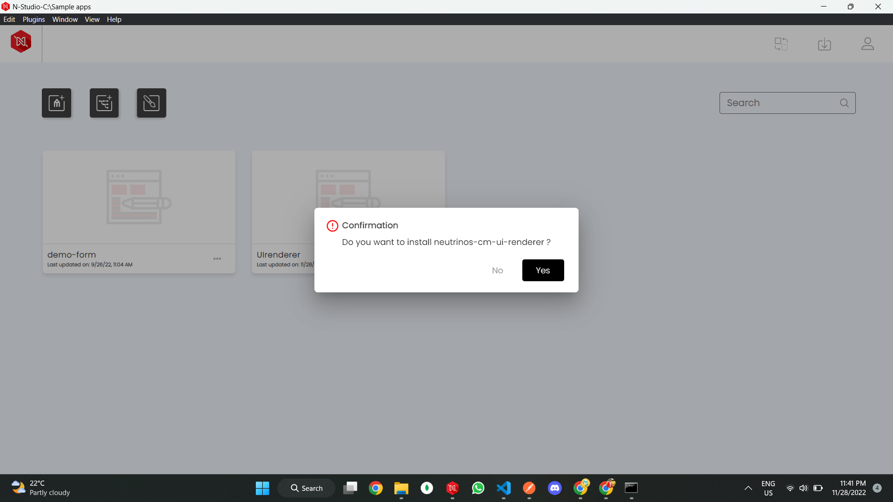
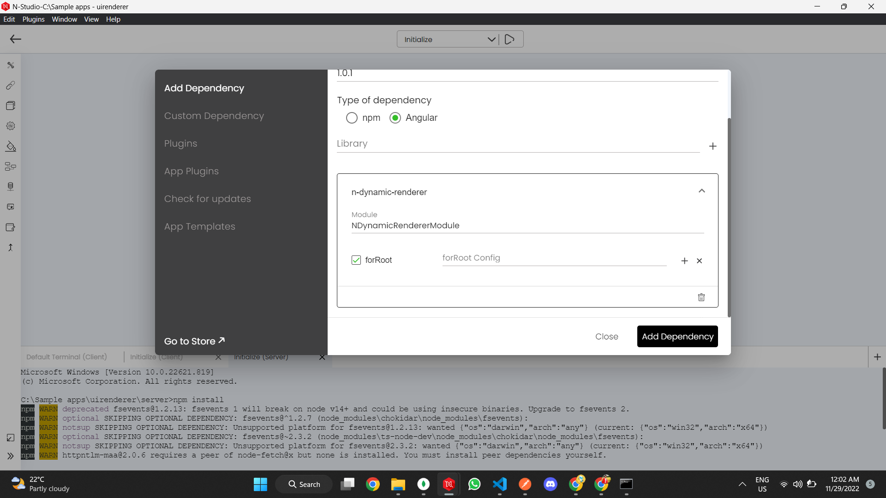
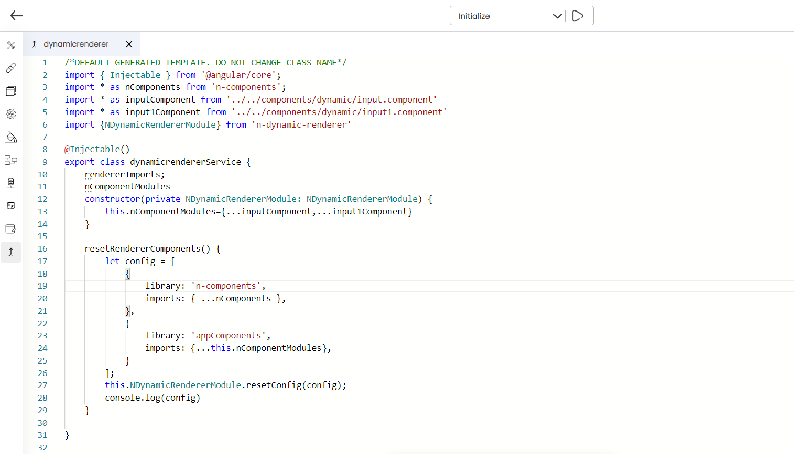
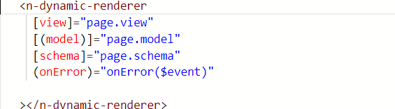
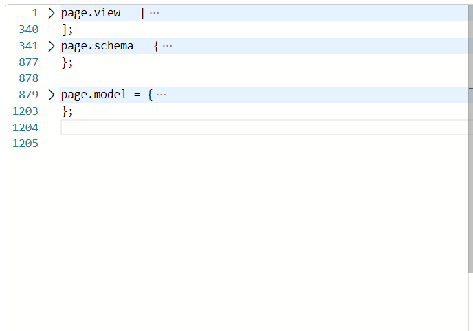

# NDynamicRenderer


It is a library for loading Dynamic components of the respective libraries with full life-cycle support for inputs and outputs.

This library accepts **View** and generates an UI as the following:




**Look at the ['View'](#view) how it is structured**

## Installation

$ npm install n-dynamic-renderer

## Usage

Download the __Case Manager UI Renderer__ from the story






Open 'Manage Plugins'->Add Dependency->Enter Package Name,Version,Angular Package, Library name, Module Name and checkon the forRoot()




Create a legacy service 


Pass the libraryname and its components installed in the applications by preparing the following structure:

```js
[
  {
    library: "Custom Library",
    imports: {
      className: InputClassComponent,
    },
  },
];
```

_In the above configuration,'library' should be the library name .'Imports' is an object of key-value pair where key is the componentName it's value should be the actual component._

_You can prepare as many of an array of objects of library and imports as the following_

```typescript
[
  {
    library: "Neutrinos Library1",
    imports: {
      "InputClassComponent1": InputClassComponent1,
    },
  },
   {
    library: "Neutrinos Library2",
    imports: {
      "InputClassComponent1": InputClassComponent2,
      "CheckBoxComponent": CheckBoxComponent,
      "HomePageComponent": HomePageComponent
    },
  },
];
```


The above configuration can be passed to the library as the following:

```typescript

import { NdynamicRendererModule } from ‘n-dynamic-renderer‘

 constructor(private NDynamicRendererModule: NDynamicRendererModule) {}

import { NDynamicRendererModule } from 'n-dynamic-renderer'
@Injectable()
export class dynamicrendererService {
    rendererImports;
    nComponentModules
    constructor(private NDynamicRendererModule: NDynamicRendererModule) {
        this.nComponentModules = { ...inputComponent, ...input1Component }
    }

    resetRendererComponents() {
        let config = [
            {
                library: "Neutrinos Library1",
                imports: {
                    "InputClassComponent1": InputClassComponent1,
                },
            },
            {
                library: "Neutrinos Library2",
                imports: {
                    "InputClassComponent1": InputClassComponent2,
                    "CheckBoxComponent": CheckBoxComponent,
                    "HomePageComponent": HomePageComponent
                },
            },
        ];
        this.NDynamicRendererModule.resetConfig(config);
    }

}

```
Add the above code in the legacy service created




---
## Options

- [[(model)]](#model)
- [[view]](#view)
- [[schema]](#schema)
- [(onError)](#onerror)

#### [model]

| Property  | Type   | Required |
| --------- | ------ | -------- |
| [(model)] | object | Required |

Accepts an object which should follow the **_Schema_**.Supports two way data binding as well.

```typescript
[model] = "model";
```
---

#### [view]

| Property | Type  | Required |
| -------- | ----- | -------- |
| [view]   | Array | Required |

**_View_** defines how the UI should render.

Define _[view](../interfaces/Panels.html)_ in your component's class

```typescript
View = [
  {
    panel_name: "Coverage Details",
    styles: {
      "show-border": false,
    },
    class:"panel_color",
    expanded: true,
    sections: [
      {
        section: {
          layout: {
              mobile: {
                flex: '100',
              },
              tablet: {
                flex: '100',
              },
              desktop: {
                flex: '100',
              },
              tv: {
                flex: '100',
              },
            },
            styles:{
              color:'red'
            }
          leafs: [
            {
              styles: {},
              layout: {
                  mobile: {
                    flex: '100',
                  },
                  tablet: {
                    flex: '100',
                  },
                  desktop: {
                    flex: '100',
                  },
                  tv: {
                    flex: '100',
                  },
              },
              id: "uuid1",
              metadata: {
                version: "14.2.0",
                library: "manulife",
                component_name: "NMatButtonComponent",
                options: {
                  label: "Save",
                  output_events: {
                    change_event: {
                      functions: [
                        {
                          functionName: "getMessage1",
                          arguments: [1, 2, 3],
                        },
                        {
                          functionName: "getMessage2",
                          arguments: [1, 2],
                        },
                        {
                          functionName: "getMessage3",
                        },
                      ],
                    },
                  },
                },
                expression: {
                  $eq: [
                    "@case.caseDetails.primaryLife.PersonalDetails.sex",
                    "Female",
                  ],
                },
                updateOn: "",
              },
            },
          ],
        },
      },
    ],
  },
];

```

Then add in component's template

```typescript
[view] = "View";
```


Every level in the __View__ has _'styles'_,_'layout'_ and _'class'_ in common where we defines CSS Styles as key value pairs in _styles_ object , add responsive flex properties for mobile,tablet,desktop and tv in _layout_ object ,define classes that are present in the library

* Layout desides the width of the __View__ components on the UI for respective screen resolutions.Set Layout properties accordingly.

[**_Understand the 'View' better here_**](../interfaces/Panels.htmll#template)
 
 To understand how Library generates UI .[Have a look here!](../components/NDynamicRendererComponent.html)


___

#### [schema]

| Property | Type   | Required |
| -------- | ------ | -------- |
| [schema] | object | Required |

The schema for the **_Model_**.

```typescript
[schema] = "schema";
```

#### onError()

Error handling callback.

| Property  | Type       | Required   |
| --------- | ---------- | ---------- |
| (onError) | _callback_ | _Optional_ |

Define callback in your component's class

```typescript
onError(error: any) {
  // do anything
}
```

Then add in component's template

```typescript
onError = "onError($event)";
```

## Example







```typescript
@Component({
  selector: "app-root",
  templateUrl: `
   <n-dynamic-renderer
     [view]="view"
     [(model)]="model"
     [schema]="schema"
     (onError)="onError($event)"
   ></n-dynamic-renderer> 
  `,
  styleUrls: ["./app.component.css"],
})
export class AppComponent {
  schema = {
    $id: "https://example.com/object1666938433.json",
    title: "Generated schema for Root",
    type: "object",
    properties: {
      case: {
        type: "object",
        properties: {},
      },
    },
  };
  model = {
    case: {},
  };

  view =[
  {
    panel_name: "Coverage Details",
    styles: {
      "show-border": false,
    },
    class:"panel_color",
    expanded: true,
    sections: [
      {
        section: {
          layout: {
              mobile: {
                flex: '100',
              },
              tablet: {
                flex: '100',
              },
              desktop: {
                flex: '100',
              },
              tv: {
                flex: '100',
              },
            },
            styles:{
              color:'red'
            }
          leafs: [
            {
              styles: {},
              layout: {
                  mobile: {
                    flex: '100',
                  },
                  tablet: {
                    flex: '100',
                  },
                  desktop: {
                    flex: '100',
                  },
                  tv: {
                    flex: '100',
                  },
              },
              id: "uuid1",
              metadata: {
                version: "14.2.0",
                library: "manulife",
                component_name: "NMatButtonComponent",
                options: {
                  label: "Save",
                  output_events: {
                    change_event: {
                      functions: [
                        {
                          functionName: "getMessage1",
                          arguments: [1, 2, 3],
                        },
                        {
                          functionName: "getMessage2",
                          arguments: [1, 2],
                        },
                        {
                          functionName: "getMessage3",
                        },
                      ],
                    },
                  },
                },
                expression: {
                  $eq: [
                    "@case.caseDetails.primaryLife.PersonalDetails.sex",
                    "Female",
                  ],
                },
                updateOn: "",
              },
            },
          ],
        },
      },
    ],
  },
];
}
```
